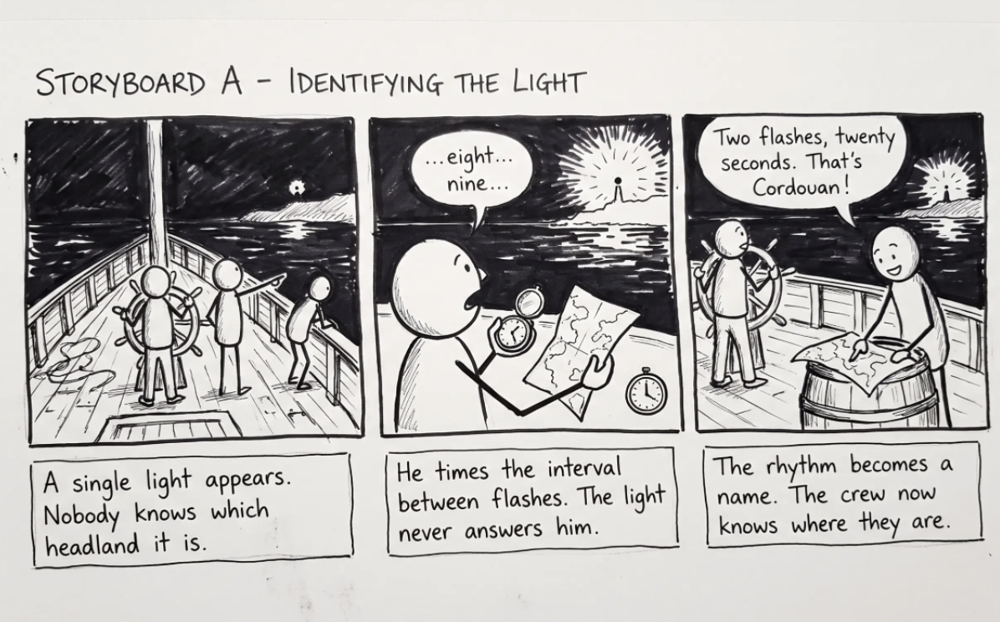
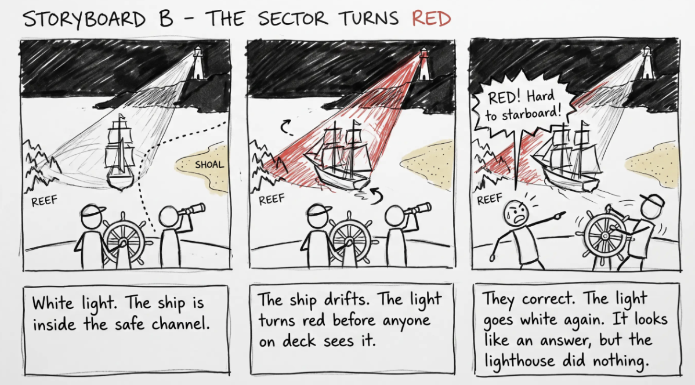
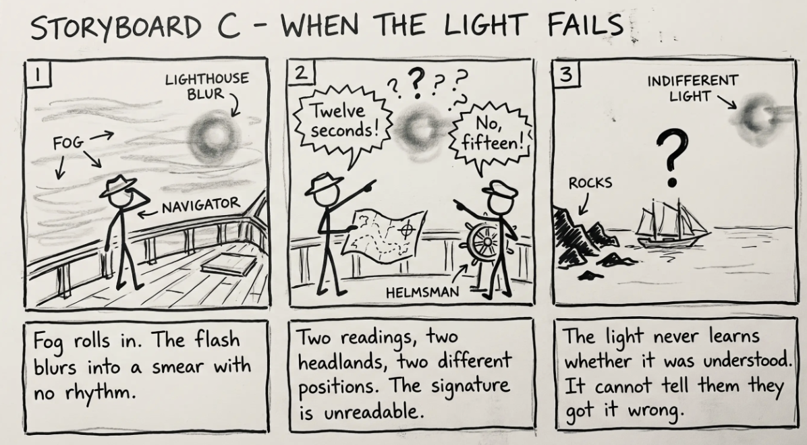
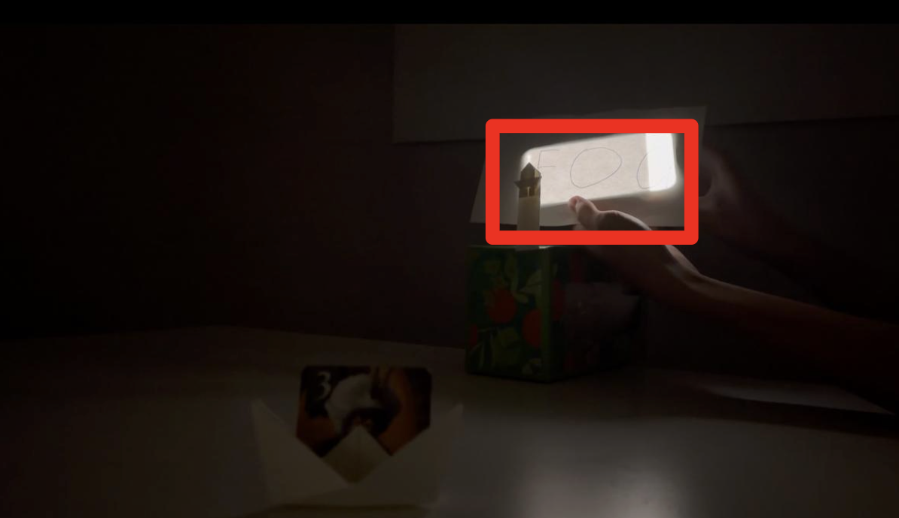

# Pablo Penalba & Daniel Xing's Lab Hub

## Part 0. Know Your Master

Before you prototype anything, get intimately acquainted with the piece you drew. Do real research. You are looking less for trivia than for the shape of the interaction:

- What inputs are available to the user? What responses does the work give?
- Who is present, and how does the piece color the relationships between them?
- What is the piece famous for? What are its strengths and its weaknesses?

Sometimes the details of how the interaction worked are lost in history. Try filling it in with your imagination!

**Describe your masterwork here, in your own words. What is the core interaction someone would recognize it by?**

Before the Fresnel lens, a lighthouse was a bright object. Oil lamps scattered light in every direction, so most of it was wasted and the useful range was short. Fresnel's lens, first installed at Cordouan in 1823, collapsed that scatter into a concentrated beam and put it on a rotating mount. The consequence was not just distance. It was legibility. A rotating beam reads from the water as a rhythm of flashes, and every lighthouse was given its own period and sequence. The light stopped being a glow and became a name.

That is the core interaction. The lighthouse never responds to you, never knows you are there, and gives you no acknowledgment, yet it answers the most urgent question a sailor has: where am I, and what is about to kill me. The input is your own position. You move along the coast, you count the interval between flashes, you match it against a chart, and the light resolves into an identity and a fix. Sectored lights push this further: the same lamp shows white when you are in the safe channel and red when you have drifted onto the hazard, so the light appears to change in direct response to you while doing nothing at all.

Its strength is that one unattended device serves everyone in range simultaneously, in the dark, at distance, with no shared language. Its weaknesses follow from the same design: no feedback that the message landed, fog erases it, and misreading one signature for another has sunk ships.

## Part A. Plan

For your masterwork, reconstruct the interaction as a scene:

- **Setting:** Where and when does this interaction happen? (a jungle, a kitchen, a spaceship corridor, a nightclub, a harbor at night)
- **Players:** Who is involved? Who else is present? Think through everyone in the setting, not just the primary user.
- **Activity:** What is happening between the players and the light?
- **Goals:** What is each player trying to do?

**Describe your setting, players, activity, and goals here.**

The setting is a rocky coastline at night, sometime in the 1830s, with fog thickening. A small cargo schooner is running for a harbor entrance that is guarded by a reef on one side and a shoal on the other. The only visible thing in the world is a single light on the headland, several miles off. Nobody is at the lighthouse in the scene; the keeper trimmed the lamp hours ago and is asleep. This absence matters, because the piece has to feel like an interaction with something that is not attending to you.

The players are the helmsman, who steers and cannot look away from the water; the navigator, who holds the chart, a watch, and the authority to say what the light means; and a deckhand or passenger who can see the same light but cannot read it, and who therefore voices the audience's confusion. The light itself is the fourth player and the only one with no intentions.

The activity is a reading, not a conversation. The navigator sights the light, counts the interval between flashes aloud, and matches the signature against the chart to establish which headland this is and therefore where the ship is. Once the fix is made, the sector does the rest: the light shows white while the ship holds the safe channel and turns red the moment it drifts toward the reef. The navigator calls a correction, the helmsman turns, and the light goes white again. That loop is the beat we want an audience to recognize, because it looks like the lighthouse is answering the ship while it is in fact just sitting there being sliced by geometry.

The goals split cleanly. The navigator wants identity first and position second, and is willing to spend nervous seconds counting to get it. The helmsman wants a heading he can trust and wants it now, so his pressure on the navigator is the source of the scene's tension. The deckhand wants reassurance and gets none, since the light offers no acknowledgment that anyone saw it. And the lighthouse, if we grant it a goal, wants only to be unmistakable, which is a strange kind of goal: it is designed to be identified rather than understood, and it never learns whether it worked.

Now sketch 3 storyboards of the interaction you are recreating. (The number may depend on the thing you drew, but stretch your thinking!) They don't need to be beautiful, but they must capture and communicate not only the behavior of the light, but how it affects the people around it. If you're new to storyboarding, read [this explanation](https://www.nngroup.com/articles/storyboards-visualize-ideas/).

**Storyboards**

## Part B. Act out the Interaction

Physically act out the interaction you planned. For now, just pretend the light is doing what you've scripted — a person can wave a flashlight, or you can narrate it aloud.

**Are there things that seemed better on paper than when acted out?**

The biggest gap between the storyboard and the floor was directionality. On paper we drew the beam as a wedge sweeping across the water, which reads instantly in a static frame. A phone screen does not do that. It emits light, it does not throw a beam, so what the audience actually saw was a glowing rectangle changing color rather than a rotating shaft of light picking us out of the dark. The whole premise of Storyboard B, that the light finds you and tells you where you are, depends on the beam having a direction and a footprint on the water. We could not stage that with a flat panel.

The related problem was distance. In the storyboard the light is miles off and tiny, which is what forces the navigator to count carefully. In a room the light is a few feet away and unmistakable, so the counting looked like stalling rather than the difficult perceptual work it actually is. The tension in the scene comes from the light being at the edge of legibility, and we lost that as soon as it was close and bright.

**Did new ideas about the piece surface once you were on your feet?**

The first was that we started reaching for AI video effects, specifically Seedance, to fake the rotating beam and the fog we could not stage physically. We talked ourselves out of it for this week. The lab is explicit that the grade rides on the light itself being recognizable, and that other modalities are next week's business. Generating a beam in post would mean the beam is not part of the interaction at all, it is decoration added after the fact, and the wizard would no longer be driving anything the actors respond to live. If we use it, it belongs in Part 2 as a deliberate remix rather than as a patch over a staging problem.

**Are there key moments in the interaction where things could go in a different direction?** Iterate your storyboards to capture key non-sequential aspects of the interaction.

The storyboard used during the actual video is an extremely shortened version of the whole story. The interaction we intended to have included the one between the light and sailors, and the one between the light and the lighthouse keepers. For the prior one, the light makes it very easy to identify lighthouses at night. Also, the light could serve as a better indicator of potential dangers near shore. For lighthouse keepers, the Fresnel lens allowed them to manipulate the light much more easily. It not only greatly reduced the overall weight of the machine but also improved the light's power.

Among those two key interactions, we decided to shorten the story and only present part of it. There are long stories behind them, and the materials we used were quite limited.

## Part C. Prototype the Light

Use your smartphone as the light of your device. Open the browser on your phone to act as the "light," and use the remote control interface on your computer to change that light. Code and setup instructions for the Tinkerbelle tool are [here](https://github.com/IRL-CT/tinkerbelle) (we invented this tool for this lab). If you hit technical trouble, a manually or remotely controlled light switch, dimmer, or lamp is a fine substitute.

Get the light interaction working before anything else. Your grade this week rides on the light being recognizable — the color, the rhythm, the timing, the way it answers a person. Only once your light interaction genuinely reads as your masterwork should you consider layering in a second modality (sound, vibration, motion). If in doubt, keep polishing the light. The other modalities are next week's business.

## Part D. Wizard the Device

Set up a "wizard" arrangement so one person can secretly drive the light while another acts with it — this is how you make the device feel alive without building any real electronics. (Zoom works well for recording; you can pin the video feed of whichever scene you want to capture.)

**First attempts at recording the wizarded set-up**

[INFO 5345 Lab 1 Videos](https://cornellprod-my.sharepoint.com/:f:/r/personal/pp555_cornell_edu/Documents/INFO%205345%20Lab%201%20Videos?d=w30c9f9f2ad6c415bb23392fe4bfca502&csf=1&web=1&e=Ovdzcx)

## Part E. Costume the Device

Only now should you worry about what the device looks like. Costume your phone so it reads as the object from your masterwork — HAL's eye, a Simon shell, a paper-lantern Tinker Bell, an Ambient Orb, a lighthouse, a jack-o'-lantern, whatever you drew.

Think about the world your device lives in: could that environment overheat it? Is water a danger? Does it need to be loud and bright for an emergency, or quiet and calm for a bedroom?

**Sketches and photos of the device**

We made a paper lighthouse, with another paper to produce a scattered fog effect. We can dig a hole on the paper where the letter O is, to show the idea of concentrating the light as light beams rather than scattered light.

**What concerns or opportunities shaped the way you designed its look?**

One of the concerns is that the light from a lighthouse is more like a point light. In contrast, the phone produces a plane light. Therefore, we decided to use origami to symbolize the structure of the lighthouse, and use the phone to reveal its contour in the dark for better representation.

## Part F. Record

Record your prototyped interaction as a video sketch. Aim for the bar from the top of this lab: a viewer who knows the piece should recognize it; a viewer who doesn't should come away understanding what it's famous for. How might you illustrate the non-sequential aspects of the interaction in the sketch?

**Video**

[INFO 5345 Lab 1 Videos](https://cornellprod-my.sharepoint.com/:f:/r/personal/pp555_cornell_edu/Documents/INFO%205345%20Lab%201%20Videos?d=w30c9f9f2ad6c415bb23392fe4bfca502&csf=1&web=1&e=Ovdzcx)

**Collaborators and influences**

We watched tutorials on how to make origami for a boat and lighthouse. We also borrowed a figure from Splendor, the board game, as our crew.

## Part 2 — ReMastering the Light

This describes the second week's work for this lab activity.

**Prep (before the next lab)**

Find three other groups. (How? Maybe Slack?) Visit their Lab Hub pages, watch their videos, and give them reactions and feedback: tell them what you saw happening, guess the masterwork and the goals of the characters, and ask about anything that wasn't clear.

Who were the other groups you kibitzed with? Add links to their project pages here. Summarize the feedback you got from your partners here.

Answer Pending

**Remix, Update, or Critique the Master**

Now that you understand your masterwork from the inside, respond to it. Do the recreation again, but this time make it your own — pick one of these moves (or combine them):

1. **Remix the modality.** Your recreation no longer has to (just) use light. Use vibration, sound, motion, heat — whatever best carries the interaction. Feel free to fork and modify the Tinkerbelle code. (Add your updates to this lab's folder!)
2. **Update it.** Redesign the piece for today's context, or for a setting its creators never imagined (the piece with roommates in the room, with children present, on a phone, in a car).
3. **Fix its weaknesses.** You identified this master's strengths and weaknesses in Part 0 — now address a weakness, or push a strength further.

We will grade this second pass with an emphasis on creativity and on how well your response engages with what your master was really doing.

Document everything here — especially the storyboard and video. Photos of the prototype are great too.

[INFO 5345 Lab 1 Videos](https://cornellprod-my.sharepoint.com/:f:/r/personal/pp555_cornell_edu/Documents/INFO%205345%20Lab%201%20Videos?d=w30c9f9f2ad6c415bb23392fe4bfca502&csf=1&web=1&e=Ovdzcx)

We chose to push a strength further. In Part 0 we argued that the Fresnel lens's achievement was not brightness but legibility, turning a glow into a signal that could be read at distance. Our first recreation showed a lighthouse working. It never showed why the lens mattered, because there was nothing to compare it against. So for the second pass we recreated the invention itself rather than the finished object.

The remix runs the same miniature through a single transformation. For the first twenty seconds the light behaves like a pre-1823 lamp: a warm scattered glow spilling in every direction, falling off so fast it dies before it reaches the paper boat, leaving the ship in darkness and the table in a muddy wash with no edges and nothing legible. Then, as the wizard moves the phone, the scatter collapses into a single narrow hard-edged shaft of cold white light that reaches the boat, lights it sharply, and throws one long black shadow across the table. Everything outside the beam gets darker than it was before, because the spill is gone. That last detail is the whole point. Concentration is not more light, it is the same light sent one direction at the cost of every other direction, and we wanted an audience to feel the trade rather than be told about it.

Technically this is the same footage from week one with the light behavior replaced. We kept the plate untouched: same camera, same table, same paper boat, same cardboard tower, same room. We kept the original audio rather than scoring it, because our Part 0 argument was that the lighthouse gives no acknowledgment, and a musical cue on the transformation would hand the audience a confirmation the light itself refuses to give.

Assignment lineage: this lab merges "Staging Interaction" (Interactive Lab Hub) with "Recreating the Masters" (Interaction Design Studio, Profs. Scott Minneman & Wendy Ju). Massive list of interactive light masterworks generated by Claude.ai.
